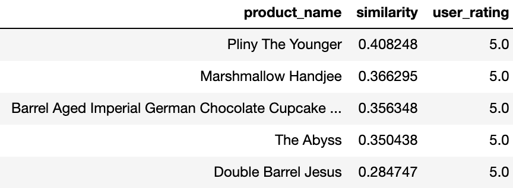

# We Got Your Beers!   
## Crowdsourced Beer Recommendation System  
  

## Quick Links  
- [Introduction](https://github.com/haohe1113/beer-rmcd-system/blob/main/README.md#Introduction)  
- [Pakages Used ](https://github.com/haohe1113/beer-rmcd-system/blob/main/README.md#Pakages-Used )  
- [Approach](https://github.com/haohe1113/beer-rmcd-system/blob/main/README.md#Approach)  
- [Analysis and Insights](https://github.com/haohe1113/beer-rmcd-system/blob/main/README.md#Analysis-and-Insights)  

## Introduction  
[Beeradvocate.com](https://www.beeradvocate.com/) is an online beer rating webstie. Alongside the ratings, people also post their reviews about the experience with various beers. In this project, we scraped beer reviews from Beeradvocate.com and used them to build a beer recommendation system with various text mining concepts. The recommendation system was required to accept user inputs about desired attributes of a product and come up with 3 recommendations.   

## Pakages Used  
* Selenium  
* NLTK  
* spaCy (Cosine Similarity)  
* VADER (Word Level Sentiment Analysis)  

## Approach  
1. Scraped Beeradvocate.com for ~6k reviews on thousands of beer products.  
2. Identified 3 beer attributes assuming that a user of this recommendation system would input in order to search for desired beers.  
3. Performed a similarity analysis between the 3 attributes and the reviews using [spaCy](https://github.com/explosion/spaCy); Extracted 300 reviews that have the highest similarity scores.  
4. Performed sentiment analysis using [VADER](https://github.com/cjhutto/vaderSentiment) on these 300 reviews and sort them by the sentiment scores.  
5. Recommended 3 beers to the user based on a general ranking system which combines similarity scores and attribute sentiment scores.  

You could find our code [here](https://github.com/haohe1113/beer-rmcd-system/blob/main/code.ipynb)  

## Analysis & Insights  
 
**1. Attributes Chosen**  
*We picked the top 3 mostly mentioned beer attributes over all reviews scraped:*    

**`Sweet`:** Malty, grainy, caramel-like;  
**`Fruity`:** Flavors reminiscent of various fruits;                                                                   
**`Robust`:** Rich and full-bodied;    

**2. Top Beers With Highest Similarity Scores**  

  

**3. Top Beers With Highest Sentiment Scores**  

  

**4. Top Rated Beers From Dataset**

  

**5. Insights**  

#### Our Recommendation: 
1. `Mornin' Delight`  
2. `Black Gold`  
3. `Marshmallow Handjee`  

By reading through the user reviews for the three products, we found that people love the maple syrup taste and the long-lasting aftertaste in `Mornin' Delight` which backs up the `sweet` preference of our user. The same thing goes to `Black Gold`, which is highly regarded for its chocolate malt, cake, vanilla and roasty flavor. `Marshmallow Handjee` gets high scores from users who love `fruity` flavor and the hit of citrus and raspberry. All of our three recommendations have a rich mix of fruity and honey flavors which fit perfectly with the user preference of `sweet`, `robust` and `fruity` drinks.   

Other than that, the three recommended beers also have good reputations for the thick and silky monthfeel. `Mornin Delight` has been rated highly for its pillowy carbonation and encroaching sticky texture while `Black Gold` was frequently praised by the lingering and chewy taste. `Marshmallow Handjee` however, was commented by multiple reviewers that it has a sharp carbonation which cuts through its massive body.  

#### Top Rates Beers From Dataset:  
1. `Pliny The Younger`  
2. `Marshmallow Handjee`  
3. `Barrel Aged Imperial German Chocolate Cupcake Stout`  

We could see there is an overlap between the top rated beers and the recommended beers by our evaluation system: `Marshmallow Handjee`. This demonstrates the massive acception for `Marshmallow Handjee` from sweet and fruity beer lovers. However, for the rest two top rated beers, we didn't find a good match with the three desired attributes. `Pliny The Younger` is a triple IPA well known by its hoppy aroma and balanced taste with crisp and bitterness. As for `Barrel Aged Imperial German Chocolate Cupcake Stout`, most of its comments regarded its light, spicy, warming barrel appearance in taste as the shining point while barely mentioned `sweet`, `robust` or `fruity`.  

We concluded from there that while looking for beers by user ratings could provide us nice beers with high general quality and unique tastes, this methodology lacks variety and reliable matching ability with features we want.  

